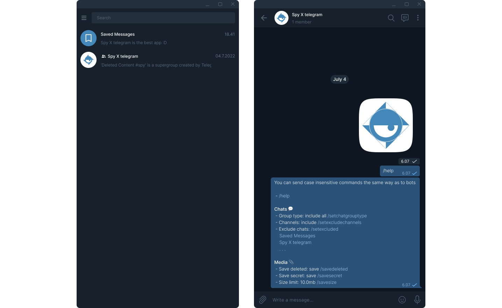

# Spy X Telegram

This is release v0.2.1. For changes and new features see the [changelog](CHANGELOG.md).

## Spy X Telegram overview

Spy X telegram is a powerful application which, at first, stores edited, deleted and secret messages. It is a cross-platform back end application, targeted on providing API allowing external apps to use telegram features. Currently intended to support both Windows and Linux. Planned to extend spy project with GUI application - web vue application and native c++ qt one.

Normal functioning application creates private telegram supergroup where a user can access settings. With additional settings the user can enable forwarding of delete content to this supergroup. Settings are represented as regular bots commands. Every command begins with `/`, to see all list send `/help`.



## Building and installing

The default `master` branch should always point to the latest bugfix release.

### Prerequisites

Spy X telegram currently supports Linux and Windows. In addition, before you can build it you need the following prerequisites:

- To build Spy X telegram  you need CMake, compiler supporting C++14(you should use GCC or MSVC compiler, because other compilers were not implied)
- You need Git installed if you are intended to user CMake superbuild, because it is the only way to download and build dependencies
- If you don’t want to use superbuild or build portable application you can build and install single components:
    - Telegram’s TD. To build and install it follow the [guide](https://tdlib.github.io/td/build.html)

Depending on your Linux distribution you can install these dependencies using `yum` or `apt-get`. Some of these packages might already be installed or might have slightly different names.

Type the following to install the dependencies using `apt-get`:

```sh
sudo apt-get install git cmake
```

Type the following to install the dependencies using `yum`:

```sh
sudo yum install cmake.x86_64 git.x86_64
```

Under Windows please directly use the appropriate installers for [CMake](https://cmake.org/download/) and [Git](https://git-scm.com/downloads).

### CMake Superbuild

For convenience, Spy X telegram provides a CMake superbuild script which will pull down dependencies and build spy itself. By default, the result is an install directory, portable application inside.

```sh
mkdir build
cd build
cmake -P <spy_source_dir>/cmake/install-oatpp.cmake
cmake -DSPY_PACKAGED_BUILD=ON -DCMAKE_INSTALL_PREFIX=<install_dir_name> ..
cmake --build . --config Release --parallel 8
cmake --install .
```

The resulting `install` directory will have standalone Spy X telegram application. There is fallowing parameters available for building:

| Param | Description |
| --- | --- |
| SPY_PACKAGED_BUILD | Enables portable application building. With setting this param to true, superbuild script will download and build zlib, openssl, gperf, jsoncpp and td from source |
| SPY_ENABLE_OPTIMIZATION | Enables /O2 optimization for msvc, and -O3 for gcc compiler |
| CMAKE_INSTALL_PREFIX | With superbuild enabled application install prefix is a directory where application will be composed. Otherwise will contain spy executable and resources |
| BUILD_JOBS | Can be used to set the number given to make -j for parallel builds insted of using --parallel option |

## Spy Rest API

To inspect endpoint you can use real time oatpp-swagger documentation on `/swagger/ui` route, or text [manual](docs/endpoints.md).

## Command Line Arguments

To control application’s behaviour spy x telegram provides several command line arguments. They can be used to enable or disable some features:

| Param | Description | Default
| --- | --- | --- |
| -p,--port | Integer parameter, defines rest server port | 8089 |
| -r,--rest | Boolean parameter which is responsible for launching rest server | true |
| --log_level | Controls amount of information printed to console. By default is set to info, but you can also use the fallowing values in incremental information order: `fatal`, `error`, `warning`, `info`, `debug` | info |
| -h,--help |  |  |
| -v,--version |  |  |